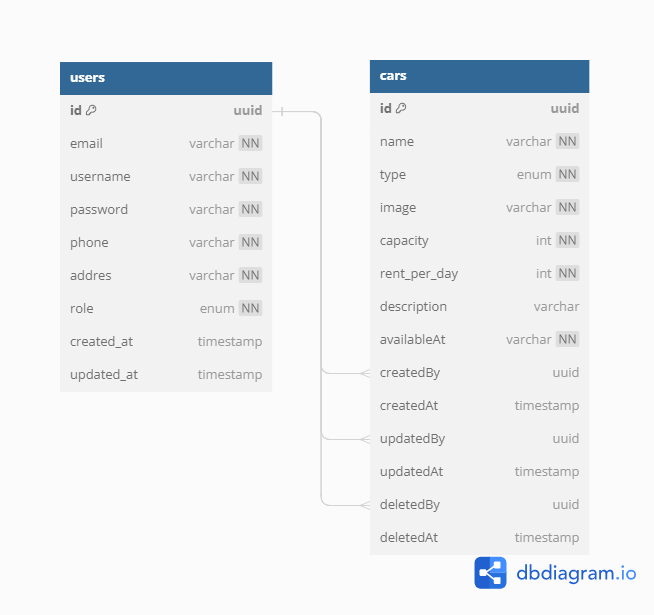

# challenge 5
simple car rest api with authentication and connect to database

### tech stack
- [node js](https://nodejs.org/en)
- [express js](https://expressjs.com/)
- [sequelize](https://sequelize.org/)
- [postgre sql](https://www.postgresql.org/)

### ERD


### documentation
- swagger documentation (hit end point after server running)
```
http://127.0.0.1:3000/api-docs or {{host}}/api-docs
```

- [postman documentaion](https://www.postman.com/mhsy/workspace/binar-challenge/collection/29693475-6ab0b6f2-71a0-43b9-bfad-2fd9c8bddf70?action=share&creator=29693475&active-environment=29693475-c420a84d-363f-40db-91a2-cf43882bc787)

### how to run
- clone this repository
```bash
git clone "https://github.com/hasyimashari/binar-challenge.git"
```

- change directory into "challenge-04"
```shell
cd "challenge-05"
```

- install dependecies
```shell
npm i
```

- change config.js in config folder with your database
```javascript
  DB_USERNAME = "BD_USERNAME",
  DB_PASSWORD = "DB_PASSWORD",
  DB_NAME = "DB_NAME",
  DB_HOST = "localhost"
```

- run migration
```shell
npx sequelize db:migrate
```

- run super admin seeder
```shell
npx sequelize db:seed --name 20231019170323-generate-superAdmin.js
```

- run car seeder
```shell
npx sequelize db:seed --name 20231015172414-carsData.js
```

- start server
```shell
npm run dev
```

- super admin credentials
```json
    {
        "email" : "super@admin3.com",
        "encryptedPassword" : "super_admin333"
    },
    {
        "email" : "super@admin2.com",
        "encryptedPassword" : "super_admin222"
    },
    {
        "email" : "super@admin1.com",
        "encryptedPassword" : "super_admin111"
    }
```